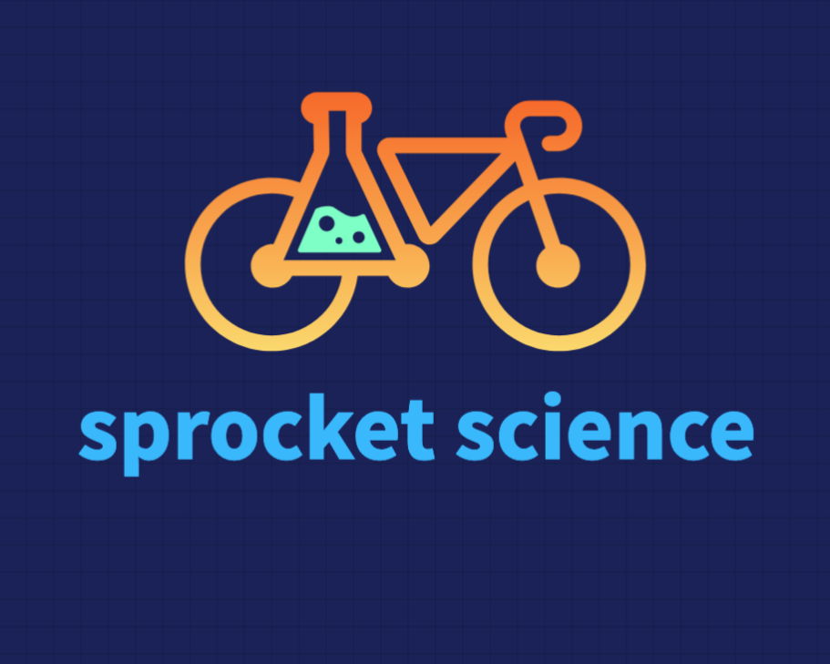

# Sprocket-Science-App 🚲

Sprocket Science is a website that makes purchasing a new bike easy. 

See all of our inventory in one place. Sort them by price make or type of bike. 

If you don't want to spring for a new bike you can see our vast Used Bike inventory. 

Click on a bike and get more details

Edit and update your bike details if you are the site owner

## Description
Back-end repo ⌨️
https://github.com/MiloCo86/bike-shop-back-end

Front-end repo 🖥️
https://github.com/MiloCo86/bike-shop-front-end

deployement URL 📡
front-end
https://sprocket-science.netlify.app/

back-end
https://sprocket-science-back-end.onrender.com

Trello Board
https://trello.com/invite/b/6697f490223b5c2210a7292b/ATTI3327916c566ee9fc2584296a72e62169B314F2AD/bike-shop 

## Authors 🧑‍💻
Brendan O'Brien
Camilo Paez
Vianel De La Cruz